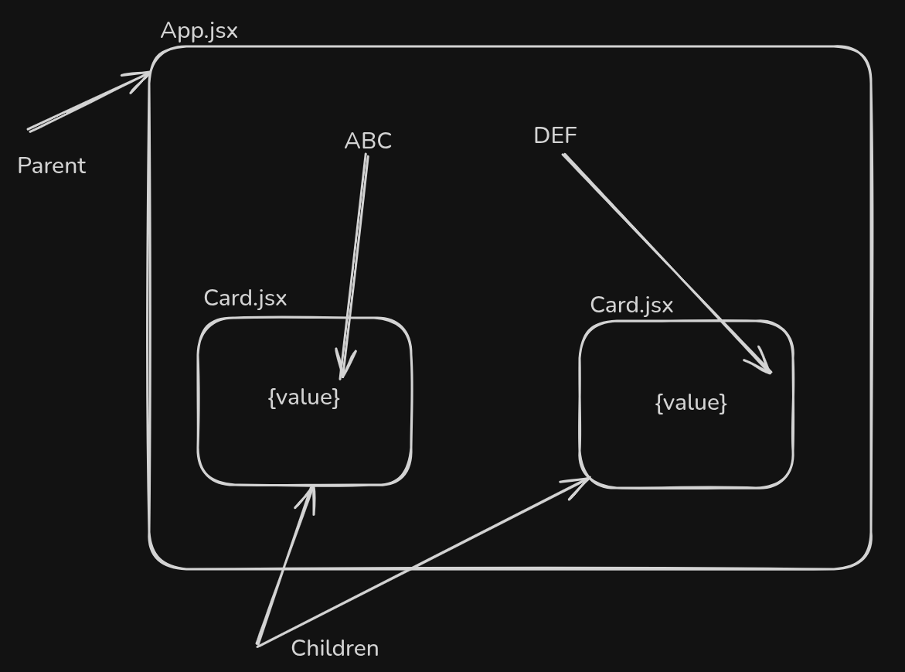
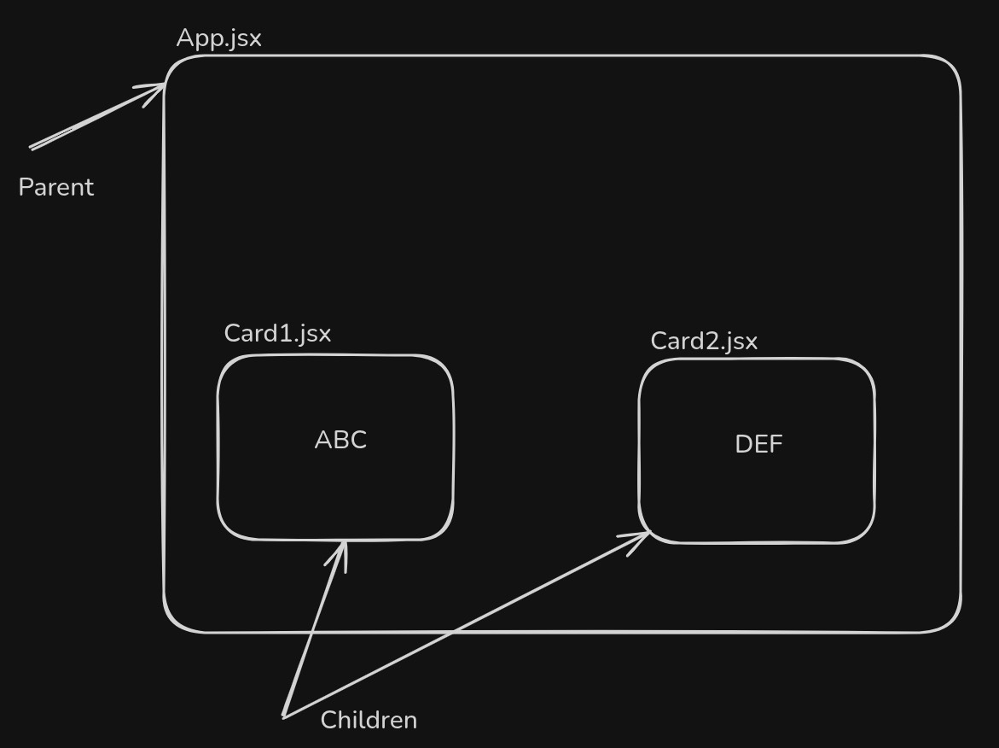

# 📘 React Notes

## 📦 Getting Started with React

🔷 React JS কী?

React JS হল একটি JavaScript লাইব্রেরি, যা ব্যবহার করা হয় ইউজার ইন্টারফেস (UI) বানানোর জন্য — বিশেষ করে সিঙ্গেল পেজ অ্যাপ্লিকেশন (SPA) এর জন্য।

`React JS is a JavaScript library used for building user interfaces (UI) — especially for Single Page Applications (SPA).`

📚 What is a Library in Programming?

A library is a collection of pre-written code that you can use to make your programming tasks easier and faster.

### Using `npx`:

```bash
npx create-react-app my-app
```

- **npx**: Executes the create-react-app package without globally installing it.
- **create-react-app**: Boilerplate generator for React projects.

### `npm` and Node:

- **npm**: Node Package Manager
- Used to manage JavaScript packages like `react`, `react-dom`, etc.
- Examples:

  ```bash
  npm init
  npm install react-scripts
  ```

---

## 📁 Project Structure

- `package.json`: Contains metadata about the project including dependencies and scripts.
- `src/`: Source folder where all React components live.

Why we use index.js <React.strict>?

<React.StrictMode> হল React-এর একটি tool, যেটা development phase-এ কোডের কোনো issue থাকলে warning আকারে দেখায়। এই warning দেখে issue গুলো fix করা যায়, ফলে কোডের মান (code quality) উন্নত হয়।

`Potential bugs বা সমস্যার warning দেয়।`

`Deprecated (পুরোনো হয়ে যাওয়া) React features detect করে।`

`কিছু function বা lifecycle methods-কে দুবার চালায়, যাতে side-effects ধরা পড়ে।`

`কোডে ভুল usage বা future incompatibility থাকলে জানিয়ে দেয়।`

`⚠️ মনে রাখতে হবে: এটি শুধুমাত্র development mode-এ কাজ করে। Production build-এ এর কোনো প্রভাব থাকে না।`

`In English`

`<React.StrictMode> is a tool provided by React to help developers write better and more reliable code. It does not affect the production build — it's only active in development mode.`

What it does:
`Shows warnings for potential problems in your code.`

`Detects usage of deprecated (outdated) React features.`

`Helps identify side effects by intentionally running some functions twice (like useEffect, constructor, etc.).`

`Encourages you to use best practices.`

Benefits:

`Helps you catch bugs early.`

`Improves your code quality.`

`Makes your code future-proof (compatible with upcoming React versions).`

```

import React from 'react';
import ReactDOM from 'react-dom/client';
import App from './App';

const root = ReactDOM.createRoot(document.getElementById('root'));
root.render(
  <React.StrictMode>
    <App />
  </React.StrictMode>
);
```

- `public/`: Open source container, holds static files.
- `node_modules/`: Installed packages.

---

## ⚙️ Important Files

- `package.json`: Lists:

  - **dependencies** (packages your app needs),
  - **scripts** (custom commands like `npm start`),
  - **version** of the app.

---

## 🧱 React Concepts

What is Transpiler?

JSX কে যে কোন একটা প্রোগ্রামিং সোর্স কোড নিবে যতটুকু দিছি ততটুকু সেম প্রোগ্রামিং লাংগুয়েজ অথবা অন্য প্রোগ্রামিং লাংগুয়েজ পাবে। JavaScript, HTML5, CSS3 file এই কোডগুলা render করতে পারে . user কে ui হিসেবে দেখাতে পারে . browser আমার কন্টেন্ট render o load করতে পারে।

`In a short`

`Transpiler হলো একটা টুল যা একধরনের কোডকে (যেমন JSX) অন্য ধরনের কোডে রূপান্তর করে, যেটা browser বুঝতে পারে।`

### JSX

- JSX stands for JavaScript XML.
- Syntax extension that allows HTML in JavaScript.
- We can write statement as JSX

  ✅ Babel – Transpiler Tool in React
  🔧 What is Babel?
  Babel is a JavaScript transpiler that converts modern JavaScript (like ES6/ES7/ESNext, JSX) into backward-compatible JavaScript that can run in older browsers or environments.

📌 Why is Babel used in React?
React uses JSX syntax, which browsers do not understand directly.
Babel converts JSX into regular JavaScript that browsers can execute.

🛠️ Example: JSX to JavaScript

✅ JSX Code:

```jsx
const element = <h1>Hello, world!</h1>;
```

🔄 Babel Transpiles to:

```js
const element = React.createElement("h1", null, "Hello, world!");
```

### Components

Component is also called custom Html element

- **Function Component**:

  ```jsx
  function App() {
    return <div>Hello React</div>;
  }
  ```

- Returns HTML (JSX) structure.

We can write components in two main ways using snippets like:

rafce → React Arrow Function Component

rfce → React Function Component (Vanilla/Regular)

1️⃣ rafce — Arrow Function Component

👉 This uses arrow function syntax.

// rafce

```
import React from 'react';


const MyComponent = () => {

  return (

    <div>

      <h2>This is an Arrow Function Component</h2>

    </div>

  );
};

export default MyComponent;
```

2️⃣ rfce — Regular Function Component

👉 This uses the classic function declaration style.

// rfce

```
import React from 'react';

function MyComponent() {
  return (
    <div>
      <h2>This is a Regular Function Component</h2>
    </div>
  );
}

export default MyComponent;
```

```
* Components must **start with a capital letter** and **return JSX**.
Component and File name will be same.
```

Component কীভাবে লিখতে পারি?

✅ 2. কোন parent না রেখে component ব্যবহার করা যায় না
নিচের কোড ভুল (parent ছাড়া দুইটি JSX element):

```js
return (
  <h1>Hello</h1>
  <p>World</p>
);
```

ঠিক কোড:

```js
return (
  <div>
    <h1>Hello</h1>
    <p>World</p>
  </div>
);
```

✅ 3. <div> একটি block element। এটি DOM এ একটি আলাদা ব্লক তৈরি করে, layout এ প্রভাব ফেলে।

✅ 4. Fragment – div এর মত কিন্তু block করে না
Fragment হলো একটা invisible wrapper যা DOM এ কোন নতুন element যোগ করে না, কিন্তু JSX এ একাধিক element একসাথে wrap করতে দেয়।

```js
return (
  <>
    <h1>Hello</h1>
    <p>World</p>
  </>
);
```

Fragment লেখার অন্য ফরম্যাট:

```jsx
import React, { Fragment } from "react";

return (
  <Fragment>
    <h1>Hello</h1>
    <p>World</p>
  </Fragment>
);
```

✅ 5. React Fragment same kaj kore
React.Fragment

```js
return (
  <React.Fragment>
    <h1>Hello</h1>
    <p>World</p>
  </React.Fragment>
);
```

✅ 6. Popular way – use start tag and close tags short syntax (<> </>) উভয়েই একই কাজ করে — multiple elements return করার জন্য একটি invisible wrapper দেয়।

Fragment এর popular/stylish উপায়:

```

return (
  <>
    <h1>Hello</h1>
    <p>World</p>
  </>
);
```

## 💡 Core Ideas

- **Client-Side Rendering (CSR)**: React renders content in the browser.
- `ReactDOM.render()` mounts the React component tree to the DOM.
- `<div id="root"></div>` is the root element for React rendering.

---

## 🛠 Scripts & Commands

```bash
npm start        # Runs the app in development mode
npm run build    # Builds the app for production
npm test         # Runs tests
```

---

## ⚙️ TypeScript Support

- React supports **TypeScript**.
- Allows static type checking in JavaScript.
- Install:

  ```bash
  npx create-react-app my-app --template typescript
  ```

---

## 🔐 JSON & Security

- **JSON**: JavaScript Object Notation — used for data exchange.
- `npm`: Can be used to manage encryption/decryption tools.
- Example keywords:

  - **encrypt**
  - **decrypt**
  - **password management**

---

## ⚡ Async & Versioning

### Semantic Versioning: `3.0.2`

- `3` = Major (breaking changes)
- `0` = Minor (features)
- `2` = Patch (bug fixes)
- 3.0.2 → Minor fix (e.g. type error fix)

---

## 💼 Real-World Use Case

- Building an **E-commerce site**:

  - React for UI
  - Components for product listing, cart, checkout
  - Backend integration for dynamic data

---

In React (and in general JavaScript), **components** and **functions** can look very similar—especially since function components are just functions. However, their **purpose** and **usage** differ. Here's a breakdown:

---

### ✅ Function (General JavaScript)

- **Definition**: A reusable block of code.
- **Purpose**: Performs an action, calculation, or returns a value.
- **Usage**:

  ```javascript
  function sum(a, b) {
    return a + b;
  }

  const result = sum(2, 3); // 5
  ```

---

### ✅ Component (in React)

- **Definition**: A function that returns JSX (HTML-like syntax).
- **Purpose**: Builds UI elements.
- **Usage**:

  ```javascript
  function Welcome() {
    return <h1>Hello, React!</h1>;
  }

  // Used in JSX:
  <Welcome />;
  ```

---

### 🔍 Key Differences

| Feature           | Function            | Component                      |
| ----------------- | ------------------- | ------------------------------ |
| Purpose           | Perform logic       | Create UI                      |
| Returns           | Any data type       | JSX (UI elements)              |
| Usage             | Called like `sum()` | Used like `<Welcome />`        |
| Lifecycle Methods | ❌ Not applicable   | ✅ React lifecycle applies     |
| State & Hooks     | ❌ Not used         | ✅ Can use useState, useEffect |
| React Context     | ❌ Not used         | ✅ Can consume context         |

---

### Summary

- A **React component is a special type of function**.
- While both are functions in JavaScript, components are used to **render UI** and can use **React features** (like hooks, state, props).

## Why should I learn React?

কেন React শিখবো?

Clean and organized code:
React lets you split the UI into small components, so the code stays neat and easy to manage.
কোড সুন্দর ও গুছানো রাখা যায়:
ছোট ছোট component আকারে কোড লিখলে খুঁজতে ও বুঝতে সহজ হয়।

`Code reusability:`
Once a component is made, it can be reused in many places, saving both time and effort.
কোড বারবার ব্যবহার করা যায়:
একবার বানিয়ে অনেক জায়গায় ব্যবহার করা যায়, সময় ও খরচ কমে।

`Faster with Virtual DOM:`
React uses Virtual DOM, which makes UI updates quicker and smoother than working directly with the browser DOM.
React Virtual DOM ব্যবহার করে:
DOM পরিবর্তন সহজ ও দ্রুত হয়, অ্যাপ স্মুথ চলে।

`Separation of concerns:`
Each feature or UI part is in its own component, which makes the code easy to understand and maintain.
প্রত্যেক জিনিস আলাদা রাখা যায়:
component আলাদাভাবে থাকায় মেইনটেইন করা সহজ।

## JSX, Components, and Props

## JSX Statement

- JSX stands for JavaScript XML, used in React to build UI.
- JSX হলো JavaScript XML, যা React এ UI তৈরি করার জন্য ব্যবহৃত হয়।
- It lets you write HTML-like syntax inside JavaScript.
- এটি তোমাকে JavaScript এর ভিতরে HTML-এর মতো syntax লেখার সুযোগ দেয়।
- JSX statements define React components.
- JSX স্টেটমেন্ট React কম্পোনেন্ট ডিফাইন করে।

## Component (Custom HTML Element)


- In React, a component is like a custom HTML element.
- React এ, কম্পোনেন্ট হলো একটি কাস্টম HTML এলিমেন্টের মতো।
- It is a reusable UI block, defined by a function or class that returns JSX.
- এটি একটি পুনরায় ব্যবহারযোগ্য UI ব্লক যা JSX রিটার্ন করে function বা class দ্বারা ডিফাইন করা হয়।

## Props - Data Passing Mechanism

- Props are the official way to pass data from a parent component to a child component in React.
- প্রপস হলো React এ প্যারেন্ট থেকে চাইল্ড কম্পোনেন্টে ডেটা পাঠানোর অফিসিয়াল উপায়।
- Props is an object containing properties as key-value pairs.
- প্রপস একটি অবজেক্ট যা key-value জোড়ায় property ধারণ করে।

## How Props Work?

- Parent component sends props to the child component.
- প্যারেন্ট কম্পোনেন্ট চাইল্ড কম্পোনেন্টকে প্রপস পাঠায়।
- The child component receives props and uses the data to render UI.
- চাইল্ড কম্পোনেন্ট প্রপস গ্রহণ করে এবং সেই ডেটা ব্যবহার করে UI রেন্ডার করে।

## using props



## Without using props



### Example / উদাহরণ:

```jsx
// Parent Component
function Parent() {
  return <Child name="Rafi" age={25} />;
}

// Child Component
function Child(props) {
  return (
    <div>
      <h1>Name: {props.name}</h1>
      <p>Age: {props.age}</p>
    </div>
  );
}
```

## Making Components Configurable with Props

Props let you configure a component, so the same component can be reused with different data.

প্রপস দিয়ে তুমি একটি কম্পোনেন্ট কনফিগার করতে পারো, ফলে একই কম্পোনেন্ট বিভিন্ন ডেটা নিয়ে বারবার ব্যবহার করা যায়।

This increases UI flexibility in React.

এতে React UI অনেক বেশি ফ্লেক্সিবল হয়।
